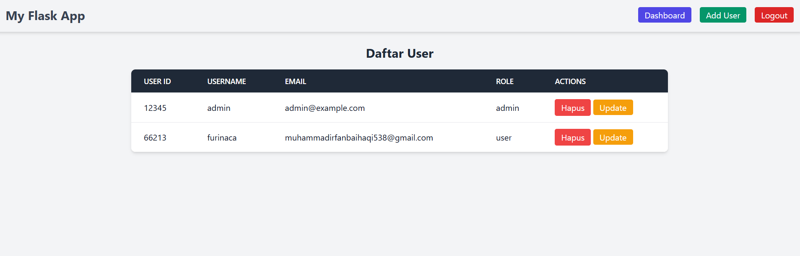
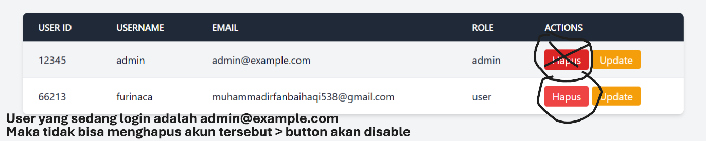
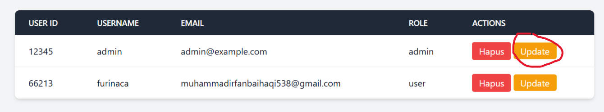
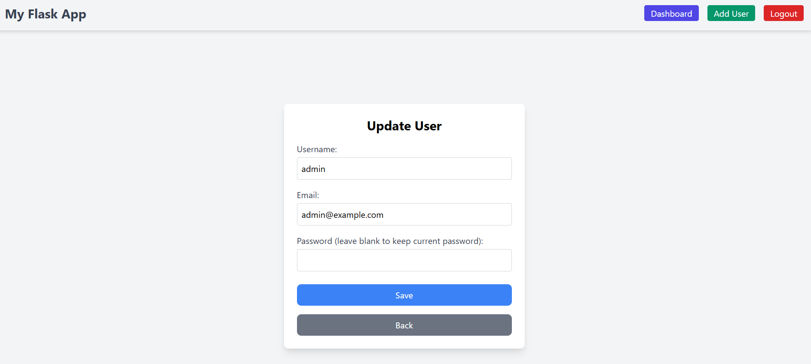
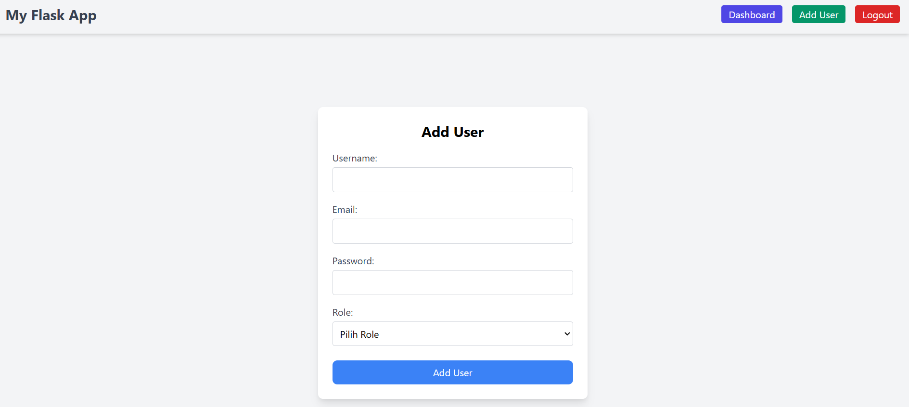
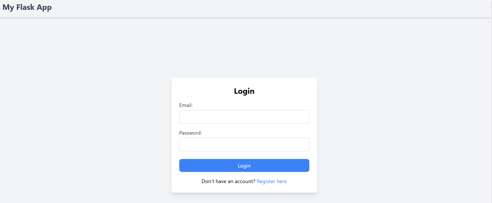
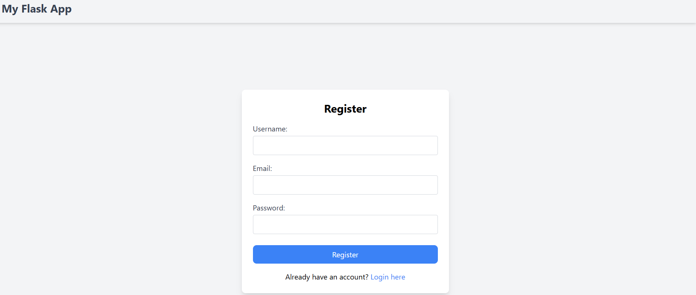
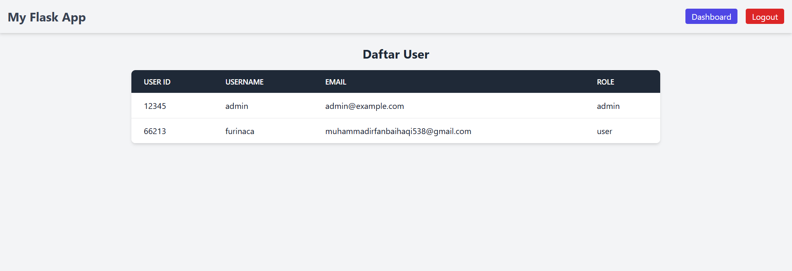

# Manajemen User

Proyek akhir mata kuliah Pemrograman Web Praktek.
Memiliki 2 Role, yaitu Admin dan User. 

- Akun dengan role user hanya bisa login dan melihat daftar akun.

- Akun dengan role Admin memiliki fitur yang lengkap untuk manajemen User.

Form registrasi awal hanya untuk mendaftarkan akun sebagai 'user'. (Tanpa Privilege). Untuk membuat akun Admin awal bisa dengan menjalankan kode di seedAdmin.py

atau dengan menjalankan kode berikut:
```bash
  python seedAdmin.py

```
maka akan dibuatkan akun untuk login SEBAGAI ADMIN:
dengan informasi user awal untuk admin adalah:

```bash
        id=12345,
        username=admin,
        email=admin@example.com,
        password=adminpassword
        role=admin
        
```

----
## PREVILEGE ATAU FITUR UNTUK ADMIN
- Melihat daftar User
## Screenshots




- Menghapus User (TIDAK BISA MENGHAPUS DIRINYA SENDIRI ATAU USER(ADMIN) YANG SEDANG LOGIN DI SESSION)
## Screenshots




- Mengupdate Informasi User
## Screenshots
menekan tombol edit pada user yang ingin diupdate

form untuk update user yang ingin diupdate


- Menambahkan User baru (baik menambahkan user dengan role 'user', maupun role 'admin')
## Screenshots




## Installation


1. Cloning Repository
2. Buat dan Aktifkan Environment

```
python -m venv env
source env/bin/activate  # Pada Windows: env\Scripts\activate

```

3. Install dependensi yang diperlukan 
```
pip install -r requirements.txt
```
4. Instal semua dependensi Node.jsyang diperlukan menggunakan npm
```
npm install
```
5. Jika Anda perlu memperbarui atau menyesuaikan gaya dengan Tailwind CSS, kompilasi file CSS
```
npm run build
```
6. Inisialisasi dan Migrasi Database
```
flask db init
flask db migrate -m "Initial migration."
flask db upgrade
```
7. (Jika belum seed user untuk admin) Menambahkan user dengan role admin secara manual
```
python seedAdmin.py
```
8. Jalankan Aplikasi
bisa run pada file app.py
atau dengan menjalankan kode berikut pada commandprompt atau bash:
```
python -m flask run
```

## NOTE:
CARA INSTALASI BISA SAJA TIDAK SAMA, DAPAT DISESUAIKAN DENGAN DEVICE YANG DIGUNAKAN 


## TAMBAHAN
Screenshoot halaman login


Screenshoot halaman Registrasi


Screenshoot untuk halaman dashboard untuk user dengan role user


